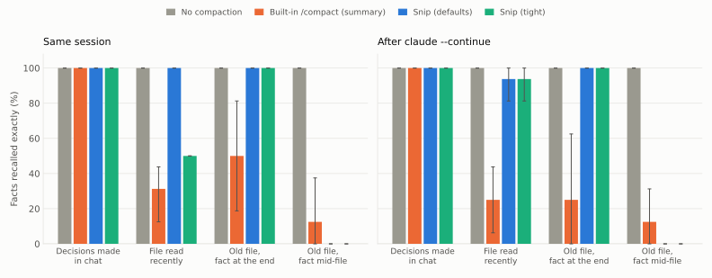
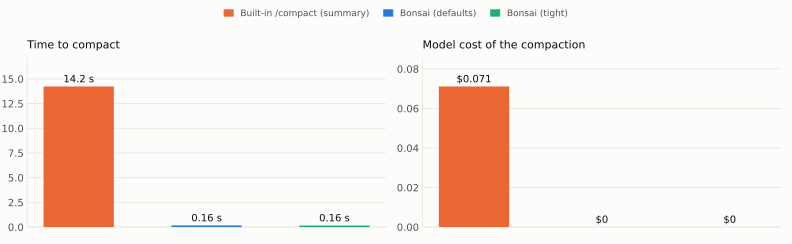
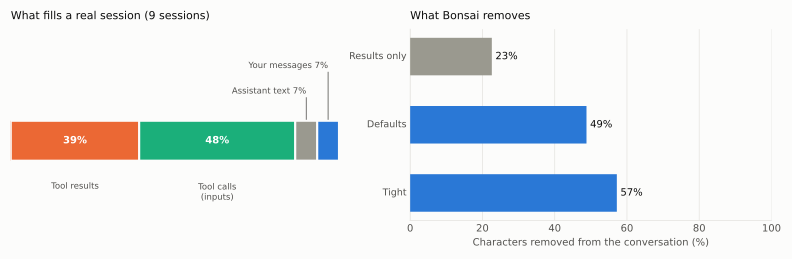

<div align="center">


# Snip

**Prune your Claude Code context. Don't summarize it.**

A Claude Code plugin that replaces `/compact`'s model-written summary with a
deterministic prune: stale and oversized tool output goes, your conversation,
decisions and plans stay word for word. Instant, free, and no extra model call.

[](LICENSE)
[](https://docs.claude.com/en/docs/claude-code)
[](#requirements)
[](hooks/prune.ts)
[](README.pt-BR.md)

</div>

---

<picture>
  <source media="(prefers-color-scheme: dark)" srcset="docs/img/recall-dark.svg">
  
</picture>

<sub>Share of facts recalled exactly after compaction, 64 real runs against Claude Code
(8 trials × 4 arms × live/resume). Full method and every caveat in
[docs/benchmark.md](docs/benchmark.md).</sub>

## Why

`/compact` asks a model to **rewrite** your session as a summary. That takes
seconds, costs tokens, and is lossy in ways you cannot predict. But look at what
actually fills a long session: in real transcripts, **87% of the text is tool
calls and their output**, and only 13% is you and the assistant talking.

Snip removes the tool output you no longer need and leaves everything else alone.

```
before                                  after
──────────────────────────────          ──────────────────────────────
you: "use port 8472"           keep     you: "use port 8472"
assistant: plan: …             keep     assistant: plan: …
tool result: 18,000 chars      cut      tool result: first 600 + last 300 chars
tool result: same Read, again  drop     [Snip pruned this result: Read a.ts …]
tool result: latest, recent    keep     tool result: latest, recent
```

## Install

```bash
claude plugin marketplace add DouglasVulcano/snip
claude plugin install snip@snip
```

That is all: the next `/compact` is a prune. No API key, no network, no extra model
calls. The installer says some options are "not yet set"; that only means you have
not customized them, the defaults apply. Inside a Claude Code session the same two
steps are `/plugin marketplace add …` and `/plugin install …`.

<details>
<summary>Or run it from source</summary>

```bash
git clone https://github.com/DouglasVulcano/snip
claude --plugin-dir ./snip
```
</details>

## What you get

|  | Built-in `/compact` | **Snip** |
|---|---|---|
| Time to compact | 14.2 s | **0.16 s** |
| Cost of the compaction | $0.071 | **$0** |
| Conversation size after (from ~98k tokens) | 19k (−81%) | 40k (−59%) |
| Specific facts recalled, same session | 48% | **75%** |
| Facts from files read recently | 31% | **100%** |
| Your messages and decisions | 100% | 100% |
| `CLAUDE.md` rules still followed | 100% | 100% |
| Facts from the *middle* of old, long results | 13% | 0% |
| Deterministic | no | **yes** |

Snip compacts less than a summary can, and it cannot keep the middle of an old
tool result. It is the right trade when you would rather keep the text exact and
re-read a file than trust a paraphrase. [The numbers, and where they come from](docs/benchmark.md).

<picture>
  <source media="(prefers-color-scheme: dark)" srcset="docs/img/cost-dark.svg">
  
</picture>

## How it works

Snip hooks `session.compact`, which every compaction goes through (your
`/compact`, Claude Code's automatic one and a plugin's), and walks the conversation
once:

1. **Protected:** your messages, the assistant's text, the last 8 messages and the
   results of `Agent`, `Task`, `AskUserQuestion` and `ExitPlanMode` are never touched.
2. **Superseded:** a result is dropped for a one-line marker if the same `Read`,
   `Bash`, `Grep`, `Glob` or `WebFetch` ran again later.
3. **Oversized:** an old result over 2,000 characters keeps its first 600 and last
   300 (errors and conclusions sit at the end).
4. **Oversized calls:** the same cut applies to long fields of old tool calls, such
   as the content of a `Write`.

`tool_use` / `tool_result` pairs are never split. If a prune would save under 15%,
Claude Code's own summary runs instead, so you are never worse off. Details in
[docs/how-it-works.md](docs/how-it-works.md).

On 9 real sessions Snip removes **49%** of the conversation's characters (median
40%); tool-call inputs, not only results, are half of that.

<picture>
  <source media="(prefers-color-scheme: dark)" srcset="docs/img/replay-dark.svg">
  
</picture>

## Configuration

Everything has a default, so you can skip this section. The installer reports the
options as "not yet set"; that only means you have not customized them.

To change one, open `/plugin`, go to **Installed**, pick `snip` and edit its options
(the screen below), or set them from the command line:

```bash
claude plugin install snip@snip --config preserveRecent=4 --config keepMaxChars=1000
```

or in `settings.json`:

```json
{ "pluginConfigs": { "snip@snip": { "options": { "preserveRecent": 4, "keepMaxChars": 1000 } } } }
```

### What to type in each field

The rows below follow the order of the configuration screen. The values shown are
the defaults, a safe place to start.

| Label on the screen | Option | Type this | Range | What it controls |
|---|---|---|---|---|
| Proactive prune above (%) | `triggerPercent` | `35` | 0–95 | Prune on its own once the context passes this share of the window. `0` turns it off. Interactive sessions only, and [untested](#limitations). |
| Retry after growing (points %) | `retryGrowth` | `5` | 1–50 | If a prune found nothing, try again only after the context grew by this many points. |
| Recent messages left untouched | `preserveRecent` | `8` | 0–200 | How many of the last messages are never touched. A tool call and its result count as two. |
| Largest old tool result (characters) | `keepMaxChars` | `2000` | 200–100000 | An old result longer than this is cut. |
| Start kept when cutting (characters) | `headChars` | `600` | 0–20000 | Characters kept from the start of a cut result. |
| End kept when cutting (characters) | `tailChars` | `300` | 0–20000 | Characters kept from the end (errors and conclusions sit there). |
| Minimum savings for a prune to count (%) | `minSavingsPercent` | `15` | 1–90 | If pruning saves less than this, the built-in summary runs instead. |
| Also prune old tool-call inputs | `pruneInputs` | `true` | true / false | Also cut long fields of old calls, such as the content of a `Write`. |
| Keep the prune when resuming a session | `relink` | `true` | true / false | Keep the prune after `--continue` / `--resume`. |
| Tools whose results are never pruned | `keepTools` | `Agent,Task,AskUserQuestion,ExitPlanMode` | comma-separated names | Calls and results of these tools are never touched. |

### Ready-made profiles

| Profile | Set | What I measured |
|---|---|---|
| **Default** | nothing | Conversation from ~98k to 40k tokens (−59%). Every fact from recent reads recalled. |
| **Gentler** | `preserveRecent` `16`, `keepMaxChars` `4000` | On the 9 real sessions it removes 39% of the characters instead of 49%. Recall was not run end to end for this profile. |
| **Tighter** | `preserveRecent` `4`, `keepMaxChars` `1000`, `headChars` `400`, `tailChars` `200` | Conversation down to 28k (−72%). Recall of facts from recent file reads falls to 50% in a live session (94% after resuming), against 100%. |
| **On demand only** | `triggerPercent` `0` | Snip acts only when you run `/compact` or Claude Code compacts by itself. |

More tuning advice, and how to keep a tool's output whole:
[docs/configuration.md](docs/configuration.md).

## Limitations

Read these before you rely on it.

- **Cut results are gone.** A fact in the middle of an old, long tool result is no
  longer in the context. Claude can read the file again; it will not remember it.
- **Resuming a session is noisier.** The prune survives `--continue` (about 43k
  tokens against 106k), but I measured the engine sometimes bringing part of the cut
  content back and, in 1 of 16 resumed runs, losing a recent fact. I could not fully explain
  it. [Details](docs/benchmark.md#3-after---continue).
- **The proactive trigger is untested.** Pruning on its own at a share of the window
  needs `$.session.compact()`, which does not exist in headless sessions, so I could
  only exercise `/compact`. Treat `triggerPercent` as experimental.
- **One model, one synthetic scenario, small samples.** Haiku, 8 trials per cell.
  The benchmark page lists how the design shaped the result.
- **Early-access API.** Function hooks may change between Claude Code releases.

## Requirements

Claude Code with function hooks. Tested on **2.1.293**, where no flag is needed.
Older releases that ship them as early access may need
`CLAUDE_CODE_ENABLE_FUNCTION_HOOKS=1` in the `env` block of `settings.json`.

## Benchmark it yourself

```bash
node bench/replay.mjs                     # free: replays your own transcripts, keeps only aggregates
node bench/e2e.mjs --trials 8             # real runs against the engine (uses your usage)
python bench/report.py                    # charts + summary.json
```

## Contributing

Issues and pull requests are welcome, especially new pruning rules backed by a
number from the benchmark, and an adapter for other agents (the pruner in
[`hooks/prune.ts`](hooks/prune.ts) has no Claude Code dependency). See
[CONTRIBUTING.md](CONTRIBUTING.md).

## License

[MIT](LICENSE) © Douglas Vulcano
