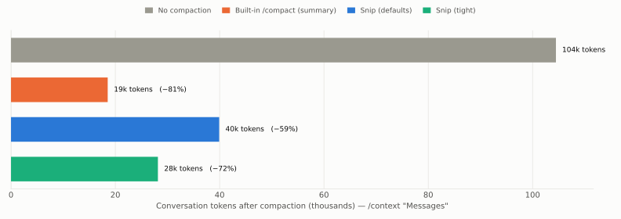

# Benchmark

Everything on this page was measured against the real Claude Code engine
(2.1.293, Claude Haiku) and can be reproduced with the scripts in
[`bench/`](../bench/README.md). Raw runs are in
[`bench/results/e2e.json`](../bench/results/e2e.json), the aggregates in
[`bench/results/summary.json`](../bench/results/summary.json).

**Short version:** Bonsai is a different trade-off, not a free lunch. Compared
with the built-in `/compact` it compacts less (−59% of the conversation against
−81%), but it takes 0.16 s instead of 14 s, costs nothing, keeps every recent fact
and the whole conversation word for word, and in this benchmark remembered
**75%** of specific facts against **48%**. What it cannot keep is the *middle* of
an old, long tool result.

## 1. End-to-end: does the model still know things afterwards?

Each run builds the same seeded project, walks a model through a realistic session
(five file reads, a `Grep`, a re-read of one file, a last read), compacts it, and
then asks eight questions with tools off.

- **8 trials × 4 arms × 2 modes = 64 runs**, no failed runs.
- **Arms:** no compaction · built-in `/compact` · Bonsai with defaults · Bonsai
  tight (`preserveRecent=4`, `keepMaxChars=1000`).
- **Modes:** `live` (same process) and `resume` (process closed, then
  `claude --continue`).
- **Paired:** every arm sees the same seeded files and facts in a given trial.
- **Facts:** a port and a database name decided in chat; and one fact in each of
  six source files (~23 KB each), every file also holding about 30 look-alike
  constants and 30 look-alike `NOTE(ops)` comments. Of those, two are in files read
  *recently*, two are at the *end* of an *old* file and two in the *middle* of an
  *old* file.
- **Scoring:** a fact counts only if the value is exactly right and the model
  did not call a tool to fetch it again. Intervals are 95% bootstrap intervals
  over the 8 trials.


### Recall, same session

| Arm | All facts | Chat decisions | Read recently | Old file, end | Old file, middle |
|---|---|---|---|---|---|
| No compaction | 100% | 100% | 100% | 100% | 100% |
| Built-in `/compact` | 48% (38–63) | 100% | 31% (13–44) | 50% (19–81) | 13% (0–38) |
| **Bonsai** | **75%** (75–75) | 100% | **100%** | **100%** | 0% |
| Bonsai tight | 63% (63–63) | 100% | 50% | 100% | 0% |

### Recall, after `claude --continue`

| Arm | All facts | Chat decisions | Read recently | Old file, end | Old file, middle |
|---|---|---|---|---|---|
| No compaction | 100% | 100% | 100% | 100% | 100% |
| Built-in `/compact` | 41% (28–56) | 100% | 25% (6–44) | 25% (0–63) | 13% (0–31) |
| **Bonsai** | **73%** (70–75) | 100% | 94% (81–100) | 100% | 0% |
| Bonsai tight | 73% (70–75) | 100% | 94% (81–100) | 100% | 0% |

Reading it:

- **Conversation and decisions are safe everywhere.** What you said in chat was
  recalled in 100% of runs in every arm. A `CLAUDE.md` rule (end every reply with a
  marker) was followed in 100% of runs in every arm too.
- **Bonsai keeps what is recent and what sits at the edges of old results**,
  because it keeps their exact text. The summary kept less than a third of facts
  from recently read files: a summary says *that* a file was read, not what was
  in it.
- **Bonsai loses the middle of old, long results, completely.** That is the price.
  The summarizer kept one in eight there; its summary is lossy in a different place.
- Bonsai's intervals are narrow because it is deterministic: the same transcript
  always prunes the same way. The variation is only the model's answers.

## 2. What it costs



| Arm | Conversation after (from ~98k) | Whole request after | Time to compact | Model cost of the compaction |
|---|---|---|---|---|
| No compaction | ~104k | 138k | n/a | n/a |
| Built-in `/compact` | 19k (−81%) | 50k (−64%) | 14.2 s | $0.071 |
| **Bonsai** | 40k (−59%) | 70k (−49%) | **0.16 s** | **$0** |
| Bonsai tight | 28k (−72%) | 59k (−58%) | 0.16 s | $0 |

"Whole request" includes the ~40k tokens of system prompt, tools and skills that no
compaction touches. All token counts are the engine's own (`/context`), not
estimates.


The built-in summary is a model call over the whole conversation, so it takes
seconds and is billed. Bonsai's prune is plain code in the hook: the 0.16 s above is
the whole `/compact` round trip, and the pruning itself takes about a millisecond.

## 3. After `--continue`

The prune survives resuming a session: after `claude --continue` the conversation is
~43k tokens for Bonsai against ~106k with no compaction. That needed a fix
(`relink`, see [how it works](how-it-works.md#why-relink-exists)): without it,
resuming silently restored the unpruned history (77.3k tokens against 76.9k for the
control in an earlier test).

Resume is **noisier** than a live session, and I have not been able to explain all
of it. In some runs the engine brought back part of the content that had been cut:
for the tight arm the re-read file was recalled in 7 of 8 runs after resuming and in
0 of 8 live, while the conversation size varied between 24k and 38k tokens. In one
run of the default arm a recent fact that should have been kept was lost. Deleting
every transcript row before the compaction boundary removed that effect, so it comes
from how the engine rebuilds the conversation on resume, but the chain of
`parentUuid` links from the last row does not cross the boundary, so I do not know
the exact mechanism. Treat resumed results as approximate.

## 4. Real sessions: what would it remove?

`bench/replay.mjs` replays real Claude Code transcripts through the pruner. No API
calls, and only aggregate numbers are kept. On 9 real sessions with at least 30
messages (token estimate = characters ÷ 4):


- A real conversation is **39% tool results and 48% tool calls**, only 13% is you
  and the assistant talking. Bash output is 60% of all tool-result text.
- With defaults Bonsai removes **49%** of the characters overall (median session
  40%, 90th percentile 55%). Pruning results alone would remove 23%: the other half
  comes from cutting long inputs of old tool calls such as the content of a `Write`.
- The aggressive preset removes 57%, the gentle one 39%.
- Pruning takes 0.8 ms for a typical session and 2.5 ms at most.

The 9 sessions are one person's, from one month. Run it on yours.

## 5. Limitations of this benchmark

- **One model.** Claude Haiku. A larger model might summarize more faithfully.
- **Synthetic project.** Random code with one fact hidden among many look-alikes.
  The first version of this benchmark used unique, meaningful names for the target
  facts and the built-in summary found *all* of them (8/8): a summarizer notices a
  needle that stands out. Adding look-alike decoys is what made the task realistic,
  and it is also a design choice that affects the result.
- **Tools are off by instruction, not by force.** In real use the model would
  just read the file again after forgetting. That works for both approaches, and
  costs tokens and a turn.
- **Small samples.** 8 trials per cell. The intervals say how wide the doubt is.
- **One scenario.** A session of reads. Editing, test loops and long chats behave
  differently; the replay on real sessions is the broader check.
- **The proactive trigger is not covered.** `$.session.compact()` does not exist
  in headless sessions, so the automatic prune at a percentage of the window could
  not be exercised here, only `/compact`.

## Reproduce

```bash
node bench/replay.mjs                                  # free, offline
node bench/e2e.mjs --trials 8 --concurrency 4          # real API usage
pip install matplotlib numpy && python bench/report.py # charts + summary.json
```
